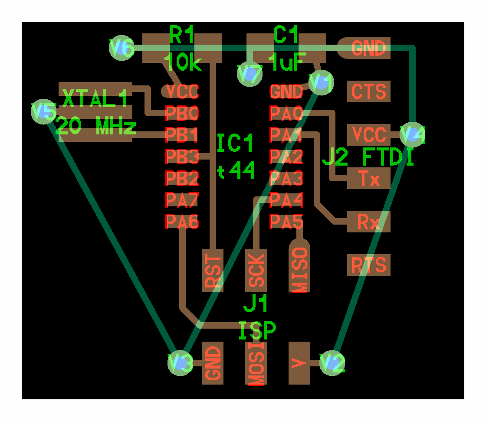

# pyCircuits

Forked from [https://gitlab.cba.mit.edu/pub/libraries/tree/master/python](https://gitlab.cba.mit.edu/pub/libraries/tree/master/python)

make these executable:  
`chmod +x pcb.py`  
`chmod +x frep.py`  

execute:  
`pcb.py | frep.py`  

view:  
`out.png`

optional arguments:  
`pcb.py | frep.py dpi`  
`pcb.py | frep.py dpi filename`  

dependencies:  
- Python  
- NumPy  
- Python Imaging Library  

sample:  

