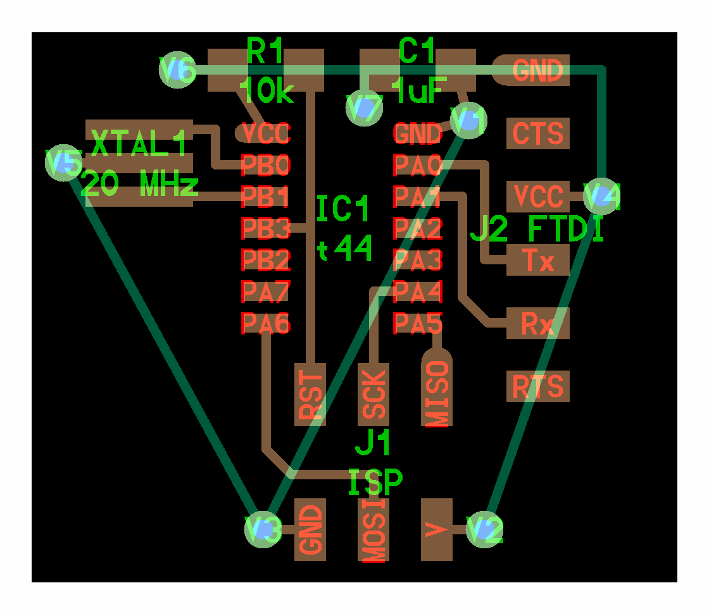

# vim-o-pelli

Forked from [https://gitlab.cba.mit.edu/pub/libraries/tree/master/python](https://gitlab.cba.mit.edu/pub/libraries/tree/master/python)

Inspired by [kokopelli](https://github.com/mkeeter/kokopelli) 

## WTF is this shit?

TL;DR This is a workflow for generating circuit board images by coding in vim instead of drawing with kiCAD or other software.

## vim installation

For convenience, I  created a vim keybinding to `F3` for saving the file while still being in *insert mode*. This step is optional. In vim to save a file you have to exit *insert mode* by pressing `ESC` key, then executing the save command `:w` followed by the `enter` key and then entering again *insert mode* by pressing `i`. So if you want to just press `F3` to save the file add this to your `.vimrc`

`inoremap <F3> <C-o>:w<CR>`

Then I created another vim keybinding to `F4` that saves the file and executes the `trigger.sh` script 

> Not working at the moment

`inoremap <F4> <C-o>:w | :!trigger.sh<CR>`

## How it works

When you save the file vim executes the script `trigger.sh`. Inside the spript it runs:

`python pcb.py | python frep.py 300`

`pcb.py` creates a functional representation of the circuit board and saves it in json format. The ouput is passed to `frep.py` which evaluates the functions and generates an RGB matrix which is saved as an image.  

view:  
`out.png`

optional frep arguments:  
`frep.py dpi`  
`frep.py dpi filename`  

## Usage

Open a `feh` image viewer that reloads every few seconds  
`feh --auto-zoon -R 2 &`

Open `pcb.py` in vim and start editing. When you want to refresh the image, save the file as usual or press `F3`.  

## Dependencies
  
- Python 3 
- NumPy  
- Python Imaging Library  
- feh image viewer

